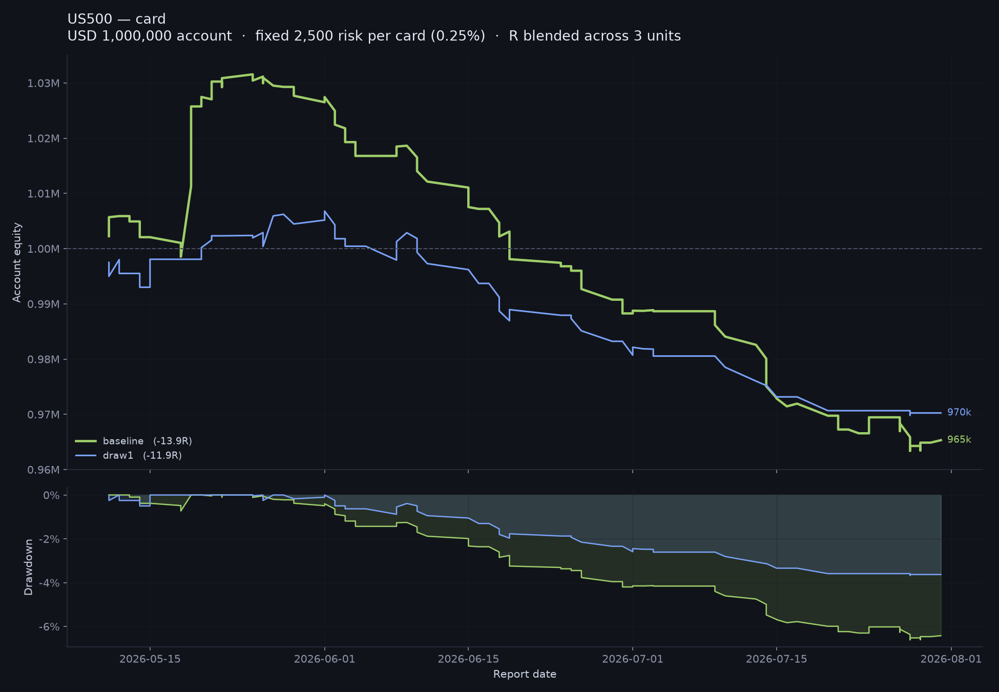
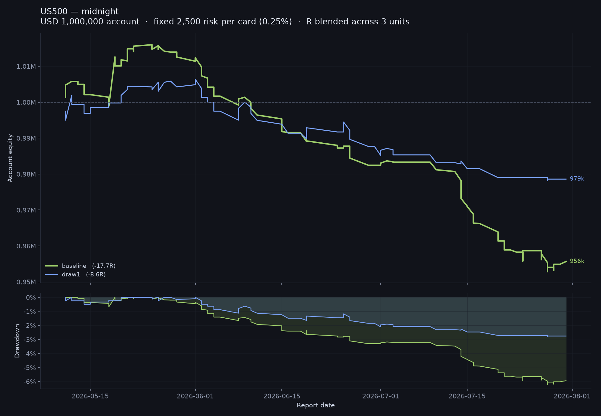
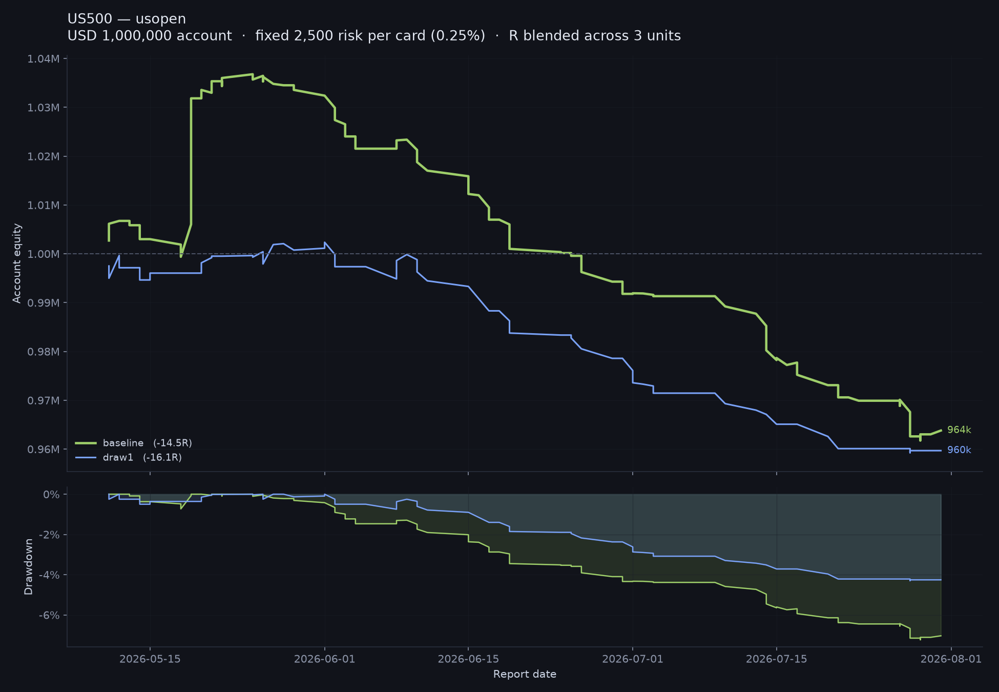
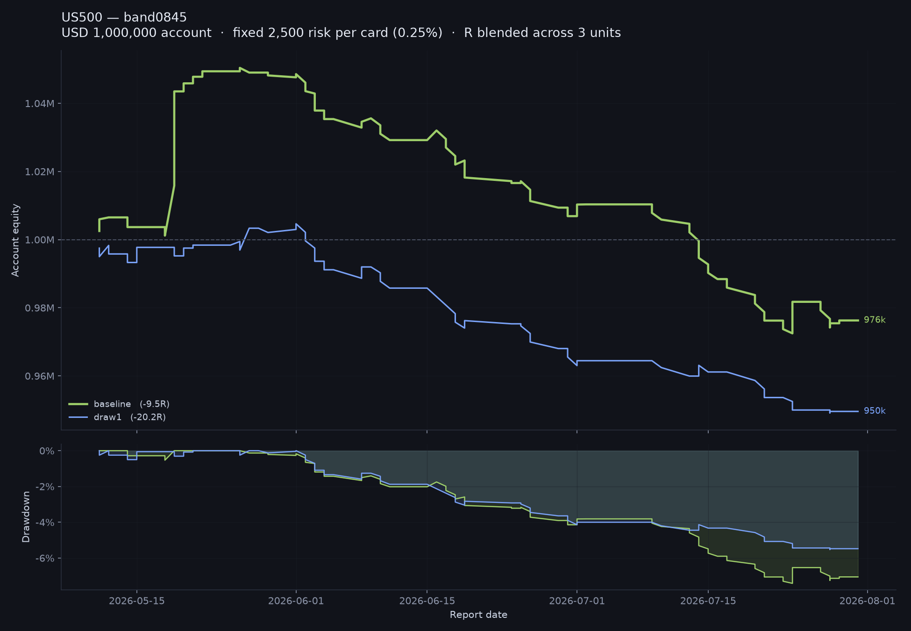
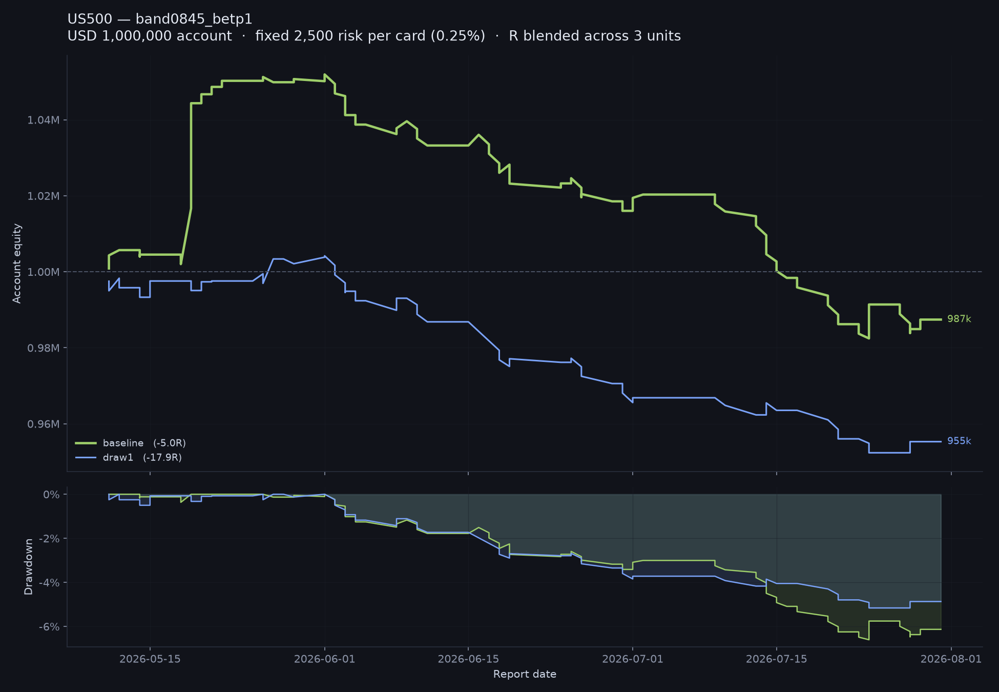

# REPORT — regen_20260906_qa1 (US500)

Baseline institutional trade cards vs cards regenerated after QA feedback, scored leak-free against
broker M15 data. Written per `docs/STATS_PLAN.md`.

| | |
|---|---|
| asset | US500, `data/raw/US500_p_M15.csv` (broker = UTC+3) |
| report dates | 54 (2026-05-11 → 2026-07-31) — **effective N = 54**, not 162 cards |
| baseline cards | 159 (20 suppressed) |
| regenerated cards | 162, **draw K = 1 only** (69 suppressed) |
| session window | OPEN 09:00, CUTOFF 23:00 broker |
| regression check | baseline `band0845` reproduces **−9.49 R** ✓ |

---

## 0. Read this first

**The headline result is that there is no result.** Under the STATS_PLAN "what counts as a result"
rule the comparison fails on every clause: no bootstrap CI excludes zero, the sign of the difference
is not consistent across policies (2 of 5 favour the regenerated arm, 3 favour the baseline), and
the ≥60%-of-draws criterion cannot be evaluated at all because only one draw was regenerated.

What the data does show, clearly and consistently, is **structural, not directional**: the
regenerated book trades about 36% less often and its daily P&L is compressed toward zero
(daily-R standard deviation falls 55–65% under every policy). Whether that compression reads as a
gain or a loss depends entirely on whether the baseline happened to be winning or losing in the
window — and in this window it was winning in May and losing in June–July. Section 4 shows the
policy-level sign flip is a direct consequence of that, not of card quality.

---

## 1. Headline table

Total R, blended across three units, non-filled = 0. Fill rate is over all 162 slots in both arms.

| policy | baseline R | regen R | diff | block-bootstrap 95% CI | P(diff ≤ 0) | fill rate | mean R \| filled | win rate |
|---|---:|---:|---:|---|---:|---|---:|---|
| `card` | −13.87 | **−11.90** | **+1.97** | [−28.02, +24.49] | 0.405 | 48.8% → 30.9% *** | −0.176 → −0.238 | 30.4% → 34.0% |
| `midnight` | −17.73 | **−8.56** | **+9.17** | [−8.54, +24.97] | 0.138 | 48.8% → 30.9% *** | −0.224 → **−0.171** | 29.1% → 38.0% |
| `usopen` | −14.48 | −16.13 | −1.65 | [−35.38, +22.70] | 0.499 | 48.1% → 30.2% *** | −0.186 → −0.329 | 26.9% → 30.6% |
| `band0845` | −9.49 | −20.17 | −10.68 | [−57.15, +22.31] | 0.655 | 43.8% → 31.5% * | −0.134 → −0.395 | 31.0% → 25.5% |
| `band0845 --be tp1` | −5.03 | −17.88 | −12.85 | [−59.43, +20.29] | 0.697 | 43.8% → 31.5% * | −0.071 → −0.351 | 36.6% → 31.4% |

`***` p ≤ 0.001, `*` p ≤ 0.05 (two-proportion z on the fill rate). Bootstrap: 5,000 resamples of the
54 report dates with replacement, all cards of a date kept together.

Paired tests (Wilcoxon on non-zero differences / sign test, both on 162 slot-paired cards):

| policy | n non-zero diffs | Wilcoxon p | sign test | p | Mann-Whitney on filled R, p |
|---|---:|---:|---|---:|---:|
| `card` | 86 | 0.134 | 50/86 + | 0.161 | 0.822 |
| `midnight` | 87 | **0.029** | 55/87 + | **0.018** | 0.789 |
| `usopen` | 87 | 0.179 | 50/87 + | 0.198 | 0.530 |
| `band0845` | 73 | 0.655 | 39/73 + | 0.640 | 0.494 |
| `band0845 --be tp1` | 73 | 0.919 | 36/73 + | 1.000 | 0.494 |

`midnight` is nominally significant on both paired tests. It is one of five policies with no
correction for multiplicity, its bootstrap CI still covers zero, and its sign does not survive to
the other entry policies. Under the STATS_PLAN rule this is **suggestive at most**.

### Note on the pairing

`engine/stats.py` pairs with an inner merge on `card_id`, which is wrong here: the M5 regime fork
names the third card by regime (`Trade_3A` / `3B` / `3C`), so a date where the two arms read the
regime differently produces different card_ids and the merge **drops exactly the cards where the
arms diverge most** — 89 of 159 matched on card_id, but 99 of 99 baseline slots match on
(date, slot). `engine/slot_key.py` (new) re-keys both summaries on `<report_date>_slot<N>` and
reindexes onto the union of slots; three baseline Trade 2 slots that carry no card are padded with
R = 0 and `fill_status = NO CARD`, which is what an unwritten card earns. Total R is byte-identical
before and after in both arms — only the pairing changes. All paired tests above use the re-keyed
files in `results/paired/`.

---

## 2. Fills, and why "total R" alone is not the comparison

The regenerated book suppresses 69 of 162 slots (42.6%) against the baseline's 20 of 159 (12.6%).
A suppressed card scores exactly 0 R, so a heavily-suppressed book is pulled mechanically toward
zero. The three quantities have to be read together:

| policy | filled cards | **mean R conditional on filling** | total R |
|---|---|---|---|
| `card` | 79 → 50 | −0.176 → −0.238 (worse) | −13.87 → −11.90 (better) |
| `midnight` | 79 → 50 | −0.224 → **−0.171 (better)** | −17.73 → −8.56 (better) |
| `usopen` | 78 → 49 | −0.186 → −0.329 (worse) | −14.48 → −16.13 (worse) |
| `band0845` | 71 → 51 | −0.134 → −0.395 (worse) | −9.49 → −20.17 (worse) |
| `band0845 --be tp1` | 71 → 51 | −0.071 → −0.351 (worse) | −5.03 → −17.88 (worse) |

**Conditional on being traded, the regenerated cards are worse under four of five policies.** The
only total-R improvement that is not explained by trading less is `midnight`, which is also the only
policy where conditional mean R improves. `card` gets a better total R out of a *worse* per-trade
edge purely by having fewer trades — that is arithmetic, not skill.

Win rate rises in four of five (26.9→30.6, 29.1→38.0, 30.4→34.0), but mean R falls at the same time,
so the regenerated arm wins slightly more often and loses more when it loses. Mann-Whitney on the
filled-card R distributions is non-significant everywhere (p ≥ 0.49): the distributions are not
distinguishable at N = 49–79 filled cards.

---

## 3. Defect rates (Stage 3, restated)

Full detail in `qa/regen_20260906_qa1/lint_comparison.md`.

| | baseline | regen draw1 | two-prop z |
|---|---:|---:|---|
| live cards | 139 | 93 | — |
| clean rate | 44.6% | 54.8% | z = +1.53, p = 0.130 |
| **dud rate** | **2.2% (3)** | **0.0% (0)** | z = −1.43, p = 0.154 |
| cards with ≥1 flag | 55.4% | 45.2% | z = −1.53, p = 0.130 |

Every purely static defect class goes to zero — inverted TP3 ladders (10 → 0), unreachable TP1
(10 → 0), oversized R (3 → 0), duplicated cards (2 → 0), both dud classes (3 → 0) — and undersized R
falls 17 → 3. Those were the targets of the module edits, and on those the regeneration did its job.
Neither rate difference reaches significance at these denominators, but the direction is unambiguous
and the dud count is a hard zero.

The one counter-result: `MISPLACED_LIMIT` **worsens**, 19.0% → 32.6% of limit orders sitting on the
unfavourable side of the day-D anchor. Section 2 is where that shows up in R — regenerated limit
entries fill less often and, when they do, fill worse.

---

## 4. Breakdowns — the compression, and where the policy sign flip comes from

### By month (total R)

| policy | 2026-05 base → regen | 2026-06 base → regen | 2026-07 base → regen |
|---|---|---|---|
| `card` | +11.07 → +1.79 | −15.76 → −8.50 | −9.18 → −5.19 |
| `midnight` | +5.03 → +1.71 | −12.05 → −6.63 | −10.72 → −3.64 |
| `usopen` | +13.43 → +0.30 | −16.71 → −8.87 | −11.20 → −7.56 |
| `band0845` | +19.28 → +0.84 | −16.52 → −14.62 | −12.24 → −6.38 |
| `band0845 --be tp1` | +20.28 → +0.84 | −13.87 → −13.61 | −11.44 → −5.12 |

The pattern is the same in all five rows and it is not subtle. **The baseline was strongly positive
in May and strongly negative in June–July. The regenerated arm is close to zero in all three
months.** It gives up most of the baseline's May gain and avoids much of its June–July loss.

That is the whole story of the sign flip in §1. Under `midnight` the baseline's May gain was only
+5.03, so surrendering it costs little and the June–July avoidance dominates → regen wins by +9.17.
Under `band0845` the baseline's May gain was +19.28 — its single best stretch — so surrendering it
costs everything and regen loses by −10.68. **The policy ranking is a ranking of how much of May
each policy captured, not of card quality.** With 54 dates and one three-month window, that is not
separable, and no amount of resampling fixes it: the bootstrap resamples the same May.

### Dispersion

| policy | daily-R sd, base → regen | mean abs daily R | max drawdown (2,500/R) |
|---|---|---|---|
| `card` | 1.79 → 0.79 | 0.93 → 0.53 | −6.6% → −3.7% |
| `midnight` | 1.08 → 0.75 | 0.74 → 0.52 | −6.2% → −2.8% |
| `usopen` | 2.07 → 0.73 | 0.97 → 0.53 | −7.2% → −4.3% |
| `band0845` | 2.64 → 0.95 | 1.25 → 0.70 | −7.4% → −5.5% |
| `band0845 --be tp1` | 2.63 → 0.94 | 1.24 → 0.69 | −6.6% → −5.2% |

Daily-R standard deviation falls 30–65%, and maximum drawdown falls under every policy. The
day-to-day correlation between the two arms is near zero (ρ = −0.01 to +0.26): these are not the
same book with better levels, they are substantially different books.

**This is the one finding that is consistent across all five policies and is not an artefact of the
window.** The QA-driven regeneration produced a materially lower-variance, lower-turnover book. In a
window where the baseline lost money that looks like an improvement; it would look like an
opportunity cost in a window where the baseline made money. This test cannot tell those apart.

### By trade slot (total R)

| policy | slot 1 base → regen | slot 2 | slot 3 |
|---|---|---|---|
| `card` | −5.70 → −9.84 | −2.88 → −2.71 | −5.29 → **+0.65** |
| `midnight` | −6.31 → −6.78 | −8.39 → **−1.06** | −3.04 → −0.72 |
| `usopen` | −8.65 → −10.52 | −5.46 → −5.34 | −0.37 → −0.27 |
| `band0845` | −6.82 → −12.96 | −2.67 → −6.61 | +0.01 → −0.60 |
| `band0845 --be tp1` | −6.10 → −12.29 | −1.07 → −6.26 | +2.14 → +0.67 |

Slot 1 (Trade 1, daily directional) is worse in the regenerated arm under **all five** policies —
the only card family with a consistent adverse sign. It is also the least-suppressed family
(44/54 live baseline, 37/54 regen, against 20/54 and 12/54 for slot 2), so the fill counts barely
move (33 → 29 under `card`, 28 → 25 under `band0845`) and the damage is per-trade rather than
compositional: mean R conditional on filling goes −0.173 → −0.339 under `card` and −0.244 → −0.518
under `band0845`, with win rate 25.0% → 16.0%. That is the clearest candidate for a genuine harm
from the module edits, and the first thing to look at before a second asset. Slot 3 (the regime-forked card) is the family where the arms diverge structurally, and it
moves toward zero as expected.

---

## 5. Trust Score and Card Integrity as covariates

The 54 reports scored: Trust Score mean 60.5 (sd 9.1, range 41–77); bands Low 29, Moderate 22,
High 3, Very High 0. Card Integrity mean 96.1 (sd 5.1, min 80).

OLS of per-report total R on Trust Score and Card Integrity, both arms, all five policies (n = 54):

| policy | arm | b(Trust) | p | b(Integrity) | p | R² | Spearman ρ(Trust, R) | p |
|---|---|---:|---:|---:|---:|---:|---:|---:|
| `card` | baseline | +0.001 | 0.970 | +0.015 | 0.758 | 0.002 | +0.116 | 0.405 |
| `card` | regen | +0.015 | 0.204 | +0.002 | 0.946 | 0.032 | +0.209 | 0.130 |
| `midnight` | baseline | +0.002 | 0.908 | +0.007 | 0.811 | 0.002 | +0.064 | 0.648 |
| `midnight` | regen | +0.019 | 0.107 | −0.021 | 0.312 | 0.063 | +0.274 | 0.045 |
| `usopen` | baseline | +0.001 | 0.976 | +0.020 | 0.735 | 0.002 | +0.105 | 0.450 |
| `usopen` | regen | **+0.023** | **0.040** | +0.007 | 0.710 | 0.086 | +0.319 | 0.019 |
| `band0845` | baseline | −0.006 | 0.883 | +0.019 | 0.793 | 0.002 | +0.041 | 0.769 |
| `band0845` | regen | **+0.031** | **0.031** | −0.009 | 0.731 | 0.088 | +0.340 | 0.012 |
| `band0845 --be tp1` | baseline | −0.010 | 0.801 | +0.025 | 0.737 | 0.003 | −0.018 | 0.897 |
| `band0845 --be tp1` | regen | +0.028 | 0.052 | −0.009 | 0.720 | 0.073 | +0.312 | 0.021 |

**The finding here is the baseline row, and it is negative.** In the baseline arm the Trust Score
has no relationship with outcome under any policy: every p ≥ 0.80, every R² ≤ 0.003, Spearman ρ
between −0.02 and +0.12. Card Integrity is likewise flat everywhere. Per STATS_PLAN's own framing —
"if QA score predicts outcome in the baseline, the QA rubric has validity" — **this rubric, on this
sample, does not**. It is measuring report craft (sourcing, restriction compliance, internal
consistency), not tradeable edge.

The regenerated arm does show a small positive Trust-Score coefficient, nominally significant under
`usopen` and `band0845`. I checked the obvious confound — that low-scoring reports simply produced
more suppressions and therefore R nearer zero — and it does not hold: Trust Score is uncorrelated
with the number of live cards (ρ = 0.06, p = 0.65), and adding the live-card count to the regression
leaves b(Trust) essentially unchanged (`band0845`: +0.031 → +0.031, live-card term p = 0.97). But
the effect is tiny (+0.031 R per Trust point ≈ 1.1 R across the full 36-point observed range), R² is
under 0.09, and these are 10 uncorrected tests. **Suggestive, not supported.**

---

## 6. Equity overlays

Baseline vs draw1, 2,500 per R on a 1,000,000 notional.

| policy | overlay |
|---|---|
| `card` |  |
| `midnight` |  |
| `usopen` |  |
| `band0845` |  |
| `band0845 --be tp1` |  |

The visual reads the same way in all five: the baseline curve has a pronounced May peak and a long
June–July bleed; the regenerated curve is nearly flat. Both arms end below par under every policy —
**neither book was profitable in this window.**

---

## 7. What is and is not supported

STATS_PLAN: *"Block-bootstrap CI excluding zero AND consistent sign across ≥3 of 4 policies AND ≥60%
of draws beating baseline. Anything less is reported as suggestive."*

| clause | verdict |
|---|---|
| bootstrap CI excludes zero | **fails** — all five CIs straddle zero, the narrowest being `midnight` [−8.54, +24.97] |
| consistent sign across ≥3 of 4 policies | **fails** — 2 of 5 positive (`card`, `midnight`), 3 negative |
| ≥60% of draws beat baseline | **not evaluable** — one draw was regenerated, not three |

**Not supported: any claim that QA-driven regeneration improves trade-card profitability.** The
point estimate is positive under two policies and negative under three, and every interval covers
zero by a wide margin.

**Supported, at the defect level:** the regenerated cards are cleaner in construction. Zero duds
against three, and every static defect class eliminated. That is a direct, verifiable consequence of
the module edits and does not depend on the outcome data.

**Supported, structurally:** the regenerated book is a lower-variance, lower-turnover book. Fill rate
drops ~18 points (p ≤ 0.022 everywhere), daily-R sd drops 30–65%, and maximum drawdown falls under
all five policies. This is the only result consistent across every policy.

**Negative result worth recording:** the Trust Score does not predict baseline outcome. Whatever the
rubric measures, it is not this window's P&L.

**Adverse signal worth chasing:** Trade 1 is worse in the regenerated arm under all five policies,
in the one family that is never suppressed.

### Limitations

1. **One draw, not three.** The plan calls for k = 3–5 regenerations per date and comparison of
   distributions. This is K = 1. The plan's own decision rule is unevaluable, and a single draw
   cannot separate the effect from session-to-session variance in the generation itself. This is the
   single largest gap and the first thing to close.
2. **One instrument, one regime, one window.** 54 dates, US500, 2026-05-11 → 2026-07-31. §4 shows
   the policy-level sign flip is driven entirely by whether a policy captured May, and 54 blocks
   from one three-month window cannot resolve that — the bootstrap resamples the same May.
3. **Both arms lost money.** Every cell in §1 is negative. This is a comparison of two losing books;
   "regenerated is better under `midnight`" means it lost less.
4. **Confounded suppression.** 42.6% vs 12.6% suppression means the arms are not comparable on total
   R alone. §2 separates it as far as the data allows, but a book that declines two slots in five is
   a different product, not a better version of the same one. Whether that trade is worth making is
   a mandate question, not a statistical one.
5. **Residual model prior knowledge.** The regenerating model has seen S&P 500 price history through
   its training cutoff. The leakage protocol removed engine results, market data and later reports
   from the session (see `docs/LEAKAGE_PROTOCOL.md` and the Stage 1/2 procedure notes), but it
   cannot remove what the weights already encode about mid-2026 index behaviour. This is
   irreducible with this design and argues for re-running on an instrument and window where such
   priors are weaker.
6. **Module edits were made by me between the stages.** Permitted and intended by the protocol
   ("whether to edit modules between QA and regeneration" is listed as the operator's choice), and
   done in an isolated session with no access to results, market data or report bodies — the diff
   contains no prices and no test-window dates. But the edits were informed by my own reading of the
   QA roll-up, and one of them (the pivot-corroboration gate) was wrong and had to be corrected
   mid-Stage-2, after which 28 cards were surgically rebuilt and 6 flipped from suppressed to live.
   See `modules/CHANGELOG_regen_20260906_qa1.md`. A cleaner replication would freeze the module set
   before any regeneration begins.

### Recommended next steps, in order

1. Run draws K = 2 and 3 for the same 54 dates. Without them the plan's decision rule cannot fire,
   and the `midnight` result cannot be distinguished from a lucky draw.
2. Diagnose Trade 1. It is worse under all five policies, and because it is the least-suppressed
   family its fill count is nearly unchanged — the loss is per-trade, which points at the module
   edits rather than at the suppression gates.
3. Diagnose `MISPLACED_LIMIT` 19.0% → 32.6%. §3 and §2 point at the same thing from two directions.
4. Only then repeat on a second asset. The instrument/window confound in §4 is the binding
   limitation, and more draws on US500 will not touch it.

---

## 8. Reproduce

```
# Stage 4 — scoring (OPEN 09:00, CUTOFF 23:00)
for P in card midnight usopen band0845; do
  python engine/resolver.py --cards <SET>.csv --data data/raw/US500_p_M15.csv \
      --policy $P --open 09:00 --cutoff 23:00 --out results/<SET>_$P
done
python engine/resolver.py --cards <SET>.csv --data data/raw/US500_p_M15.csv \
    --policy band0845 --be tp1 --open 09:00 --cutoff 23:00 --out results/<SET>_band0845_betp1

# re-key on (report_date, slot) before pairing
python engine/slot_key.py --a results/baseline_$P/summary.csv \
    --b results/regen_20260906_qa1_draw1_$P/summary.csv --outdir results/paired/$P

# Stage 5 — tests
python engine/stats.py --a results/paired/$P/baseline_$P.csv \
    --b results/paired/$P/regen_20260906_qa1_draw1_$P.csv \
    --labels baseline regenerated --out results/compare/stats_regen_20260906_qa1_$P.md
```

Per-policy test output: `results/compare/stats_regen_20260906_qa1_<policy>.md`.
Lint detail: `qa/regen_20260906_qa1/lint_comparison.md`. QA roll-up:
`qa/regen_20260906_qa1/trust_scores.csv`, `STAGE1_SUMMARY.md`. Module edits:
`modules/CHANGELOG_regen_20260906_qa1.md`.
